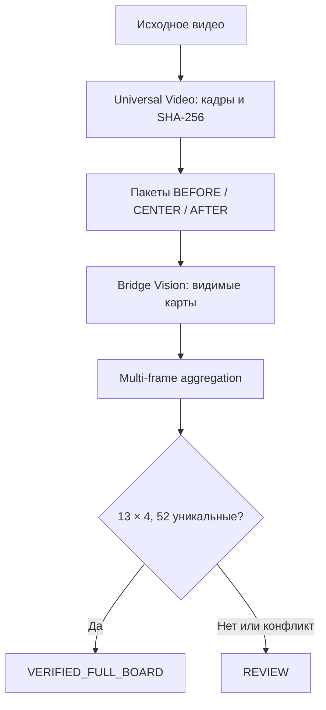

# Пакет кадров и распознавание раздачи v1

Статус: реализовано в коде, до production promotion требуется canary на реальном видео

Дата: 2026-08-30

Режим управления: `ASSURED`

## Решение

Universal Video не восстанавливает расклад во время обработки исходного видео. Его ответственность — детерминированно сформировать проверяемый пакет изображений. Bridge Vision получает этот пакет отдельным этапом, распознаёт видимые карты, объединяет только совместимые наблюдения и возвращает `REVIEW`, пока не доказаны все инварианты полной раздачи.

## Контракт видеосервера

Для профилей с `domain_plugin=bridge` каждый выбранный якорь получает соседние кадры с ролями:

- `BEFORE`: за 1,5 секунды до якоря, если время находится внутри видео;
- `CENTER`: кадр в точке якоря;
- `AFTER`: через 1,5 секунды после якоря, если время находится внутри видео.

Общий пакет ограничен 300 уникальными изображениями. Для длинного видео якоря выбираются детерминированно и стратифицированно, включая начало и конец. Каждый файл записывается в `manifest.json` с точным временем, именем и SHA-256.

`frame_evidence` в manifest содержит:

- schema `universal-video-frame-evidence-v1`;
- идентификатор и время каждого пакета;
- роли и смещения кадров;
- ссылки только на файлы из хэшированного списка `frames`;
- нормализованные зоны `N`, `E`, `S`, `W`, `CENTER`.

Зоны — подсказки для downstream-адаптера, а не утверждение о конкретном интерфейсе. Профиль распознавателя может уточнять их. Исходный полный кадр остаётся доказательством.

## Контракт анализатора

Bridge Vision:

1. получает файлы кадров, packet membership и зоны кропов;
2. сохраняет наблюдаемые карты отдельно от логически достроенных;
3. не связывает кадры только по близости времени или голому номеру сдачи;
4. отклоняет карту, назначенную разным позициям;
5. допускает вычитание колоды только при трёх полных наблюдаемых руках;
6. независимо проверяет четыре руки по 13 карт, 52 уникальные карты и точное совпадение с полной колодой;
7. возвращает `VERIFIED_FULL_BOARD` только при полном прохождении проверки;
8. во всех неполных, неоднозначных и конфликтных случаях возвращает `REVIEW`.

Автоматическое продвижение результата в школьный канон запрещено: `canonical_promotion_allowed=false` даже для технически полной раздачи.

## Наблюдаемость и откат

Контрольные поля: число пакетов и кадров, роли кадров, SHA-256, число распознанных и уникальных карт, количество карт по позициям, наличие явного логического достроения, причины `REVIEW`.

Откат не требует изменения данных: прежняя функция `extract_keyframes` сохранена как anchor-only совместимый интерфейс. Для временного отключения соседних кадров достаточно вызвать `extract_frame_evidence(..., include_neighbors=False)`; распознавание остаётся отдельным этапом.

## Проверки перед production promotion

- unit: границы пакета, роли, зоны и лимит 300 файлов;
- formal invariant: `13 × 4`, `52 unique`, полная колода;
- regression: существующие Universal Video и Bridge Vision контракты;
- canary: минимум одно реальное видео с визуальной сверкой кадров, хэшей и статуса полной/неполной раздачи;
- rollback rehearsal: повторный запуск canary в anchor-only режиме.
