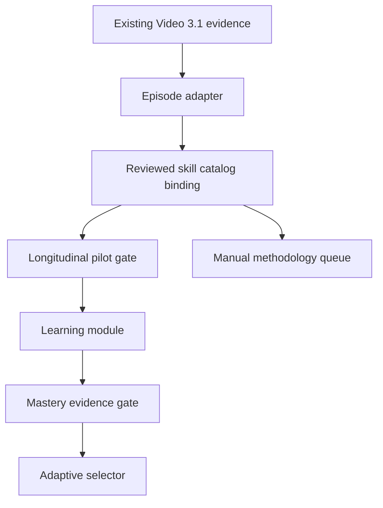

# Evolutionary Course v1 — independent implementation audit

Audit date: **2026-08-30**

Audited revision: `68162dbf3026df3aad8442fbe9ebf5c0a72b4e54`

Status: **RESEARCH CANDIDATE / NOT ACTIVE CURRICULUM**

## Executive verdict

The repository contains a coherent fail-closed research architecture for turning
already-produced Video 3.1 evidence into candidate learning episodes, skill
trajectories, reviewed learning modules, mastery reports, and deterministic
next-activity selections.

The architecture is technically ready for a **private, human-reviewed pilot on
existing artifacts**. It is not evidence that the five-year Diana archive has
been processed, that the seed methodology is pedagogically approved, or that a
production course may be activated.

No audited component grants permission to mutate SCHOOL CANON, activate a
curriculum, publish content, or write to Student Profile.

## Audited flow

Every arrow is a candidate-research transition. None is a production promotion
path.

## Component inventory

| Component | Implemented result | Audit status |
|---|---|---|
| Learning episode contract | Exact source envelope, epistemic classes, candidate transition, stable canonical hash | Implemented and tested |
| Video 3.1 adapter | Converts bounded quality artifacts; rejects unsupported input and authority escalation | Implemented and tested |
| Legacy report adapter | Converts hashed PDF/report pointers only into a private manual-annotation queue | Implemented; cannot create episodes or mastery evidence |
| Skill catalog | Stable IDs, aliases, prerequisites, mastery criteria, cycle rejection | Implemented; seed content awaits review |
| Catalog binding | Resolves only reviewed catalog skills; unknown wording remains unresolved | Implemented and tested |
| Methodology queue | Deterministic manual queue and recorded human decision | Implemented; no auto-add or activation |
| Existing-artifact pilot | Inventories sources and blocks incomplete or unconfirmed evidence | Implemented and tested |
| Multi-lesson pilot | Requires at least three distinct lessons, videos, dates, reviewed catalog binding, and safe authority | Implemented; synthetic proof only |
| Learning module | Requires sourced assets, staged exercises, errors, and remediation | Implemented and tested |
| Mastery evidence | Policy-driven evaluation and prerequisite eligibility | Implemented; read-only |
| Adaptive selector | Deterministic selection by prerequisites, state, errors, recency, format, time, and difficulty | Implemented; read-only |

## Verified safety properties

- Video 3.1 remains the evidence producer; the course performs no media, ASR,
  OCR, card recognition, or DDS work.
- All accepted research objects remain `CANDIDATE_RESEARCH`.
- FACT, INFERENCE, RECOMMENDATION, and UNCERTAIN claims remain distinct.
- Card-specific claims require exact evidence references; hidden information is
  rejected by the selector.
- WORLD material cannot claim to be a School rule.
- Unknown skills go to manual methodology review and are not silently added.
- Prerequisite cycles and duplicate activity or episode identities fail closed.
- Mastery thresholds and state-to-stage routing must arrive through explicit
  research policies; they are not invented by runtime code.
- Student Profile writes, curriculum activation, publication, and canonical
  promotion remain false throughout the audited path.

## Evidence and tests

- `71` Evolutionary Course tests pass at the audited revision.
- CI validates four JSON schemas, runs the complete
  `tests/test_evolutionary_course_*.py` suite, and compiles the package.
- Adversarial coverage includes authority escalation, missing provenance,
  duplicate sources, date mismatch, unresolved skills, prerequisite failures,
  hidden information, WORLD-as-school-rule claims, and invalid policy inputs.
- The multi-lesson success case currently uses synthetic Diana-shaped fixtures.
  Therefore it proves the contract, not real-archive coverage or pedagogical
  correctness.

## Provenance seed catalog

The seed catalog contains three candidate skills:

1. `candidate.skill.trump-long-hand`;
2. `candidate.skill.count-losers`;
3. `candidate.skill.eliminate-extra-loser`.

They form one prerequisite chain and all have `review_state=REVIEW_REQUIRED`.
They must not be represented as approved SCHOOL CANON or active curriculum.

## Material gaps

1. **No real longitudinal evidence yet.** The repository has no audited result
   showing three or more already-processed Diana lessons accepted by the pilot.
2. **Seed methodology is unapproved.** All three catalog entries require a human
   methodology decision.
3. **No independent card-recognition claim.** This course layer consumes evidence
   status and cannot establish that cards were recognized correctly.
4. **Runtime contracts exceed published schemas.** Episode, learning module,
   skill catalog, and legacy-report pointers have JSON schemas; adapter reports,
   pilot reports, methodology decisions, mastery policies/reports, and selector
   policies/reports currently rely on Python validators and tests only.
5. **No production Student Profile integration.** This is intentional. The
   current modules calculate candidate results without persistence.
6. **The overview milestone list is historical.** Its original bounded milestones
   are implemented, but their existence must not be confused with real Diana
   corpus completion.

## Decisions reserved for the director or authorized reviewers

| Decision | Why runtime cannot decide it |
|---|---|
| Approve, edit, or reject each seed skill and prerequisite | This is School methodology |
| Approve mastery thresholds and review intervals | These values define pedagogy, not validation mechanics |
| Decide whether any Diana-derived material becomes LEARNING_CONTENT | Evidence extraction does not grant publication authority |
| Approve a production Student Profile write path | It changes learner state and requires separate governance |
| Promote any rule into SCHOOL CANON | Only the canonical governance process may do this |

## Minimum safe next step

Run the existing multi-lesson gate **only on three to five already-produced,
human-reviewable Diana artifacts** with immutable source identities. Do not launch
new video processing. The result should remain private and
`CANDIDATE_RESEARCH`, with a human comparison of every accepted episode and every
skill binding.

Promotion criteria for a later step must be defined separately. A technically
successful pilot is not curriculum approval.
